# csi-pose

[English](README.md) | **한국어**

WiFi CSI(Channel State Information)만으로 단일 인물의 2차원 18관절 자세를 추정하고
그 위에 규칙 기반 낙상 감지를 얹는 시스템. 카메라·웨어러블 없이, 사람 몸에
산란·차폐되며 변형되는 2.4GHz 전파의 흔적(서브캐리어별 진폭)을 신호원으로 쓴다.

WiSPPN(Intel 5300 단일 NIC의 3×3 **안테나 행렬**)을 시판 ESP32-S3 6대(3TX×3RX)의
3×3 **링크 행렬**로 치환 이식한 구성이다. 웹캠+RTMPose가 교사(teacher)로 의사
라벨을 생성하고, 학생 모델은 50ms 윈도의 CSI 진폭 텐서에서 관절 좌표를 회귀한다 —
학습이 끝나면 추론에 카메라는 필요 없다.

<p align="center">
  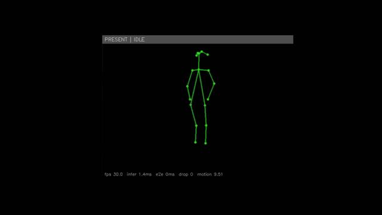<br>
  <em>실시간 데모 — 초록색 18관절 스켈레톤은 WiFi CSI만으로 추론한 것(추론 시 카메라 없음).
  상단 배너는 낙상 감지 발화를 표시: <strong>PRESENT | ALARM</strong>.</em>
</p>

## 파이프라인

```
① firmware/  ESP32-S3 TX 3대가 ESP-NOW 비컨 송신(~103pps), RX 3대가 CSI 추출
                → 130B 프레임으로 시리얼 출력 (csi_link/ 는 TX·RX 공용 컴포넌트)
② host/      bridge: 시리얼→rawlog 원본 보존+MQTT 중계 · recorder: HDF5 세션 기록
                csi_pipe: 클록 핏·정렬·샘플 빌드 라이브러리 · tools: 운영 CLI
③ teacher/   동기 녹화된 웹캠 영상에 RTMDet→RTMPose를 돌려 포즈 라벨 생성
④ train/     CSI→PAM 회귀 네트워크(WiSPPN-ESP) 학습
⑤ rt/        학습된 모델로 실시간 포즈 추정(~20Hz) + 낙상 감지 데모
```

## 시스템 아키텍처

<p align="center">
  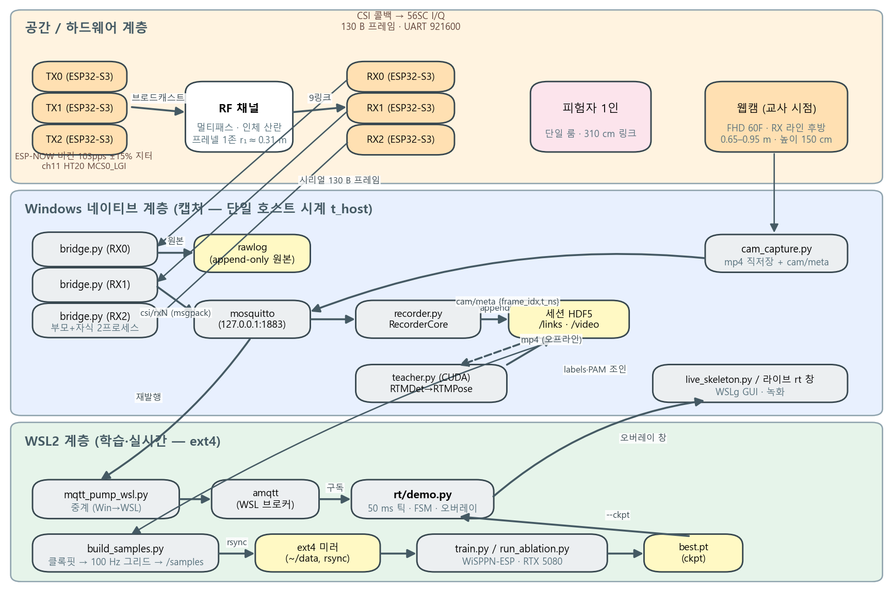<br>
  <em>3계층 구조: RF 하드웨어(ESP32-S3 TX/RX), Windows 네이티브 캡처(단일 호스트 시계),
  WSL2 연산(학습·실시간). 실선=실시간 경로, 점선=오프라인.</em>
</p>

## 무엇을 검출하나

모델은 연속적인 18관절 2D 스켈레톤을 출력하고, 그 위에서 두 가지 상위 신호를 끌어낸다:

- **자세 — 직립 vs 누움.** 추정된 스켈레톤 코어 바운딩 박스의 종횡비로 분류한다
  (대략: 세로가 길면 직립, 가로가 길면 누움). 직립→누움 전환은 아래 낙상 단서 중
  하나로도 쓰인다.
- **낙상.** 규칙 기반 유한 상태기계(IDLE → IMPACT → ALARM). 3개 단서 중 2개 이상이
  발화하면 IMPACT — (R1) 골반/엉덩이 급강하, (R2) 직립→누움 전환, (R3) 머리가 화면
  하단으로 진입 — 이후 유지 창 동안 "누움 & 정지" 자세가 확인되어야만 ALARM으로
  승격된다. 다시 일어서거나 자리를 벗어나면 경보가 해제된다.

리플레이 데모 결과: **연출된 낙상 11회 중 10회 감지, 오탐 2회** (단일 세션).

> **정직한 범위.** 낙상 임계값은 단일 세션(`fall-demo-01`)으로만 캘리브된 잠정값이며,
> 누움 부분집합·교차 세션 정량 평가는 이후 본 수집 캠페인으로 미뤄둔 항목이다. CSI
> 기반 정지 판정은 현재 비활성(자세별 모션 에너지 분포가 겹쳐 분리 실패)이라 확인은
> 포즈 기하에 의존한다. 동작하는 데모로 볼 것 — **검증된 의료·안전 장비가 아니다.**

<p align="center">
  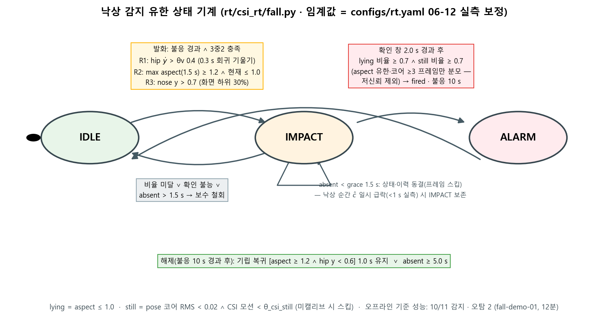<br>
  <em>낙상 감지 상태기계(IDLE → IMPACT → ALARM)와 규칙·해제 조건.</em>
</p>

<p align="center">
  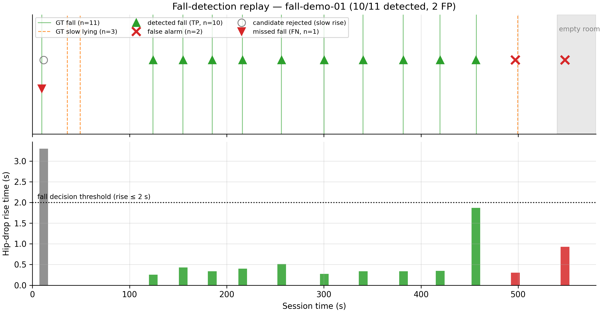<br>
  <em>720초 세션·연출 낙상 11회에 대한 리플레이 결과: recall 10/11, precision 10/12,
  참양성 상승시간 중앙값 0.34초.</em>
</p>

## 핵심 원리 1 — 시각 동기화 (이종 클록 정렬)

보드 3대의 esp_timer는 서로 독립이고 호스트 시계와도 다르다. 모든 캡처(CSI 패킷
도착, 웹캠 프레임 grab)는 **단일 호스트 시계 `time.time_ns()`** 로 스탬프하되,
USB 시리얼 도착 시각에는 배칭 지연이 섞인다. 핵심 아이디어는 이 지연의 **비대칭성**:
USB 지연은 패킷을 늦출 수만 있고 일찍 도착시킬 수는 없다. 따라서 (보드 시각, 호스트
시각) 산점도의 **하한 포락선(아래 볼록 껍질)** 이 참 클록 변환의 불편 추정이 된다.

```
 ESP32-S3 보드 시계 (esp_timer µs)        호스트 시계 time.time_ns() ── 단일 기준
        │                                        │
        └────── USB 시리얼 도착 ──────► (esp, t_host) 산점도
                                            │
              USB 배칭 지연은 +방향(늦음)만  │   ← "일찍 도착"은 물리적으로 불가
                                            ▼
                       산점의 하한 포락선 = 참 클록 변환
            (오프라인: boot 에포크별 구간 선형 핏 / 실시간: rolling-min 근사)
                                            │
                                            ▼
        모든 CSI 패킷 → 보정 시각 t_fit → 100Hz(10ms) 그리드 재표본
                                            │
 웹캠 프레임 grab 시각 (동일 호스트 시계) ───┤
                                            ▼
              페어링 보정: 참값 = 스탬프 − 보정값 (계통 지연 실측치 적용,
              CSI 경로·카메라 파이프라인 지연을 STOP 이벤트/모니터 플립으로 분해 측정)
                                            ▼
              프레임 앵커마다 직전 50ms(5패킷) CSI 윈도 절단 → 학습 샘플
```

발진기 온도 드리프트는 구간(윈도 600s)별 핏+선형 보간으로 흡수하고, 보드 리부트는
boot_id로 에포크를 분리한다. 잔여 불확도 ±15ms 수준 — 낙상 속도 2~3m/s 기준
3~5cm 라벨 노이즈에 해당한다.

## 핵심 원리 2 — 교사 라벨링 (웹캠 포즈 → CSI 라벨)

웹캠은 학습 데이터 수집 때만 쓰는 교사다. 영상에서 뽑은 관절 좌표를, 위에서 맞춘
공통 시간축으로 같은 순간의 CSI 윈도에 붙여 (X, Y) 학습쌍을 만든다.

```
 웹캠 mp4 ──► RTMDet-m (사람 검출) ──► RTMPose-m (COCO-17) ──► BODY-18 변환
   │ 프레임별 t_ns                                               │ (목=어깨 중점 합성)
   │              0명=no_person · 2명 이상=multi(폐기)            ▼
   │                                        QA 게이트 (무작위 표본 사람 눈 검수, <2%)
   │                                                             │
   ▼                                                             ▼
 t_ns 조인: 프레임 시각 = 앵커 ──► 같은 시각의 CSI 윈도와 페어링   Y = PAM (3,18,18)
                                              │                  │  대각 = 관절 (x,y,ĉ)
 9링크(3TX×3RX) × 56서브캐리어 × 5패킷        │                  │
   ──► 진폭 텐서 X (280,3,3) ─────────────────┴──► 학습: f(X) ≈ Y
                                                                 │
                                          추론은 CSI만 사용 ── 카메라 불필요
```

빈 방 프레임은 버리지 않고 presence=0 음성 샘플로 학습에 쓴다(손실 가중이 좌표항을
자동 차단). 보드 간 발진기가 독립이라 링크 간 위상차는 무작위량이므로 **링크 간 위상은
특징으로 쓰지 않으며**, 진폭(+링크 내부 위상 형상은 옵트인 ablation)만 사용한다.
보드별 AGC 차이는 링크별 L2 정규화로 흡수한다.

## 모델

<p align="center">
  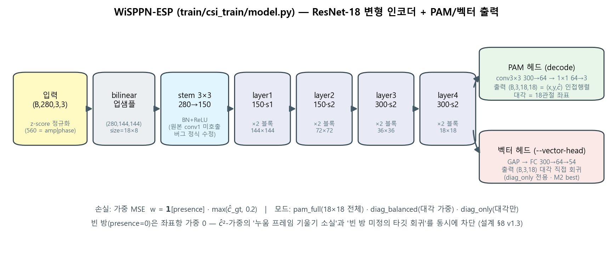<br>
  <em>WiSPPN-ESP — (280,3,3) CSI 진폭 텐서를 ResNet-18 변형 인코더로 처리하고,
  PAM decode 헤드(18×18 인접행렬) 또는 18관절 좌표를 직접 회귀하는 벡터 헤드로 끝난다.</em>
</p>

## 결과

> 단일 세션·단일 인물·단일 환경(시간순 80/20 분할). 교차 환경 벤치마크가 아니라
> 동작 데모 수치다 — 전체 범위·한계는 [기술보고서](#기술보고서)를 참고.

<p align="center">
  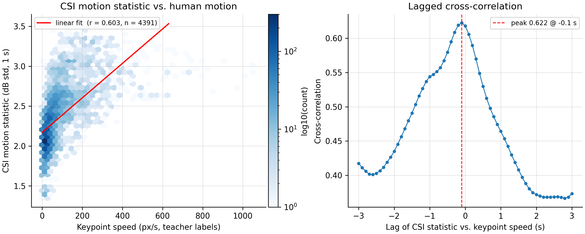<br>
  <em>CSI 모션 통계 vs 카메라 측정 인체 모션: 피어슨 <strong>r = 0.603</strong>
  (n = 4,391). 지연 교차상관 피크가 −0.1초로 100ms 미만 CSI–영상 정합을 확인.</em>
</p>

<p align="center">
  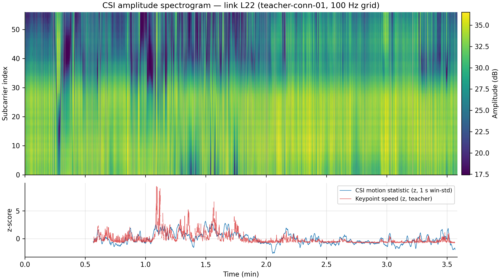<br>
  <em>CSI 진폭 스펙트로그램(단일 링크, 56 서브캐리어)과 영상 키포인트 속도를 따라가는
  CSI 모션 통계.</em>
</p>

<p align="center">
  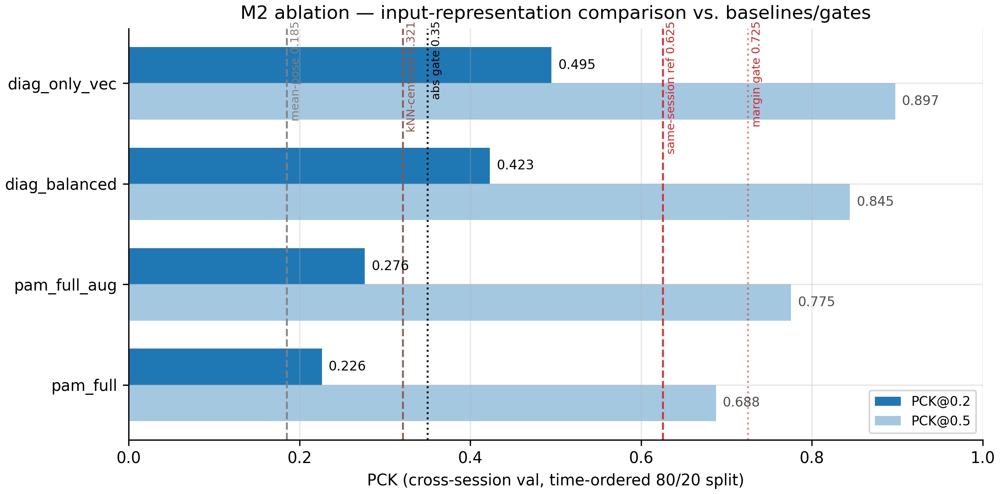<br>
  <em>입력 표현 ablation: 최고 런 PCK@0.2 = 0.495 / PCK@0.5 = 0.897 — 절대 게이트(0.35)와
  두 베이스라인(평균포즈 0.185, kNN 0.321)을 상회.</em>
</p>

<p align="center">
  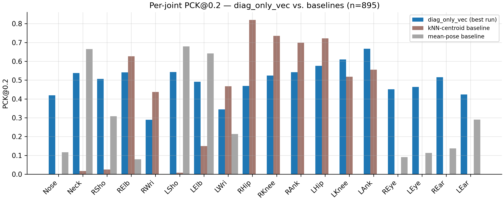<br>
  <em>관절별 PCK@0.2 vs 베이스라인 — 학습 모델은 모션이 풍부한 얼굴·팔 관절에서 우세.
  정적 포즈 재현이 아니라 모션 관련 채널 특징을 학습한다는 증거.</em>
</p>

<p align="center">
  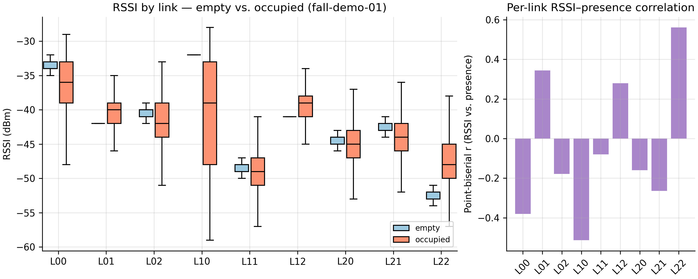<br>
  <em>링크별 RSSI 분포, 빈방 vs 재실 — 재실 시 모든 링크의 분포가 넓어져 RSSI를
  보조 입력 피처로 쓸 근거가 된다.</em>
</p>

추가 그림(서브캐리어/링크 상관, 위상 정제, 학습 곡선): [`docs/figures/`](docs/figures/) 참고.

## 하드웨어 요구사항

- ESP32-S3 개발 보드 6대 (TX 3 + RX 3, ESP-IDF로 빌드 — HT20, 56 서브캐리어)
- USB-UART 어댑터/케이블 6개 (CH340 등) 또는 보드 내장 USB Serial/JTAG
- USB 웹캠 1대 (교사 라벨 수집용 — 학습 후 실시간 추론에는 불필요)
- MQTT 브로커 (mosquitto, 기본 localhost:1883)

권장 구동 환경: 캡처(시리얼·웹캠)는 Windows 네이티브, 학습·실시간 추론은
WSL2(ext4) — 타임스탬프 단일화와 I/O 성능 때문이며, 단일 OS 환경에서도 동작한다.

<p align="center">
  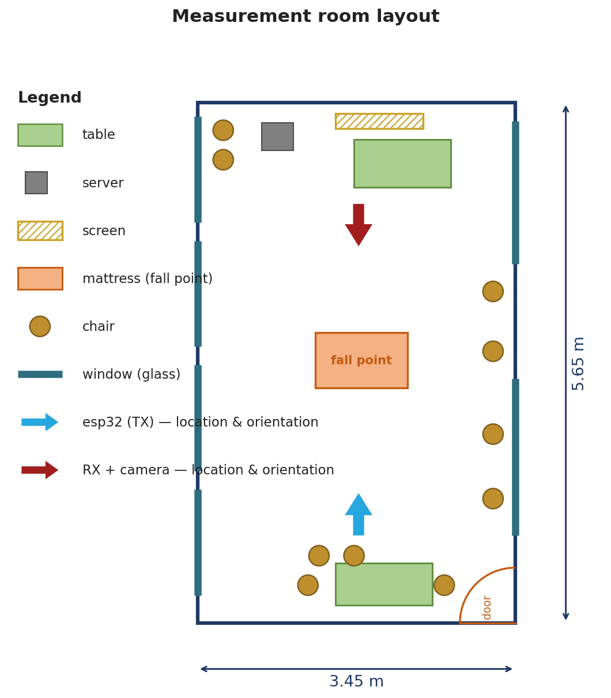<br>
  <em>측정 공간(3.45 × 5.65 m). TX 어레이(하단, 위로 향함)와 RX + 카메라 클러스터(상단,
  아래로 향함)가 긴 축을 따라 마주 본다. 중앙 매트리스가 낙상 지점.</em>
</p>

## 시작하기

```bash
pip install -r requirements.txt

# 로컬 설정 — 예시를 복사해 자기 환경 값으로 교체 (원본은 .gitignore 대상)
cp configs/boards.example.yaml configs/boards.yaml   # COM 포트·보드 MAC
cp configs/train.example.yaml  configs/train.yaml    # 세션 h5 경로

# 펌웨어 (ESP-IDF v5.x)
cd firmware/tx && idf.py set-target esp32s3 build flash    # TX 3대
cd firmware/rx && idf.py set-target esp32s3 build flash    # RX 3대
```

명명 규칙: `csi_*` 디렉토리(`csi_host/`, `csi_pipe/`, `csi_train/` 등)는 라이브러리
모듈이고, 같은 영역의 루트 스크립트(`bridge.py`, `train.py` 등)는 CLI 래퍼다.
코드 주석의 "설계 §N"·"스펙 …"은 내부 설계 문서의 절 번호다.

## 기술보고서

전체 25쪽 기술보고서 — 시스템 설계, 수식 정식화(26식), 수집 계층, 시각 정렬,
교사–학생 파이프라인, 낙상 상태기계, 실측 M0–M3 결과 — 는 릴리스에 첨부돼 있다:
**[기술보고서 (PDF, 한국어)](https://github.com/sel00000/csi-pose/releases/tag/paper-2026-06-12)**.

## 저자

Kyung-Bo Kim, Hyeon-Seok Jang, So-Hyeon Kim, Gyu-Chae Jung (기여도 순).

## 출처 및 라이선스 고지

- **`train/csi_train/model.py`** 는 [geekfeiw/WiSPPN](https://github.com/geekfeiw/WiSPPN)의
  `models/wisppn_resnet.py` 를 기반으로 수정한 비공식 구현이다.
  논문: Fei Wang, Stanislav Panev, Ziyi Dai, Jinsong Han, Dong Huang,
  *"Can WiFi Estimate Person Pose?"*, [arXiv:1904.00277](https://arxiv.org/abs/1904.00277) (2019).
  원 저장소에는 라이선스 파일이 없으며, 해당 파일의 원본 유래 부분 저작권은
  원저자에게 있다. 본 저장소는 출처 표기와 함께 이를 사용한다.
- **teacher 단계**는 첫 실행 시 [OpenMMLab mmpose](https://github.com/open-mmlab/mmpose)
  (Apache-2.0)의 RTMDet/RTMPose ONNX 모델을 download.openmmlab.com 에서 자동
  다운로드한다. 모델 파일 자체는 본 저장소에 포함되지 않는다.
- `teacher/csi_teacher/qa.py` 의 BODY-18 림 정의는 OpenPose 표준 스켈레톤
  토폴로지(사실 데이터)다.

본 저장소의 라이선스: [MIT](LICENSE).
단, 위 `train/csi_train/model.py` 의 원본 유래 부분은 본 저장소 라이선스와
무관하게 원저자 저작권이 유지된다.
