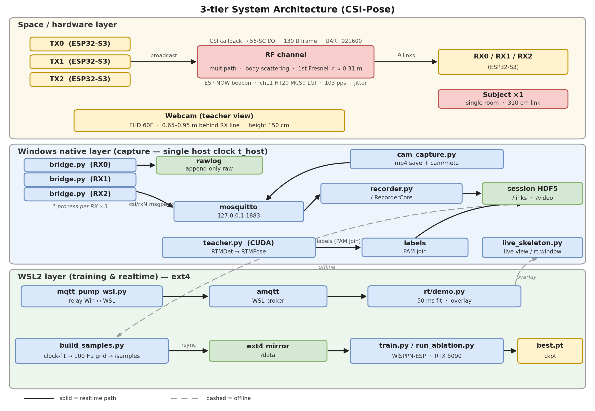
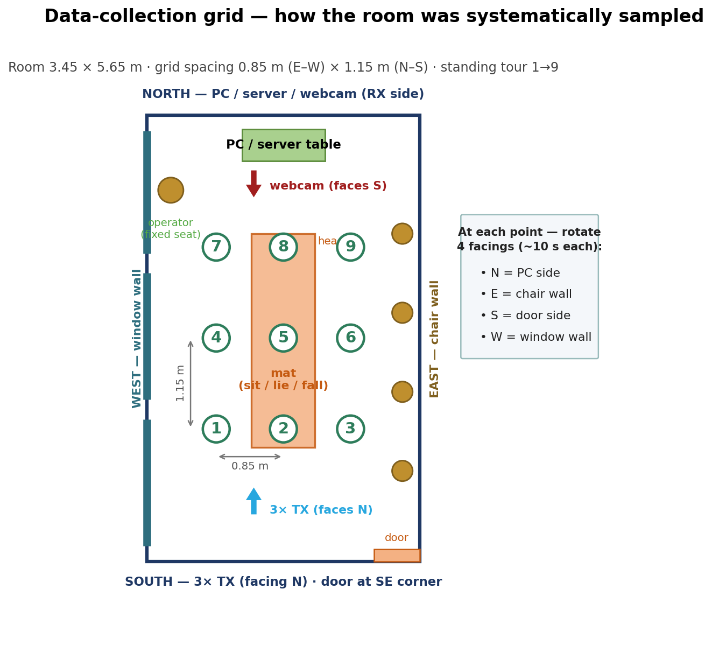

# csi-pose

**English** | [한국어](README.ko.md)

2D single-person pose estimation (18 joints) from WiFi CSI (Channel State
Information) alone, with rule-based fall detection on top. No camera or
wearables at inference time — the signal source is the trace a human body
leaves on 2.4GHz radio waves (per-subcarrier amplitude) through scattering
and shadowing.

This is a port of WiSPPN (Intel 5300 single NIC, 3×3 **antenna matrix**) onto
six off-the-shelf ESP32-S3 boards (3TX×3RX) forming a 3×3 **link matrix**.
A webcam+RTMPose teacher generates pseudo-labels; the student model regresses
joint coordinates from 50ms windows of CSI amplitude tensors — once trained,
no camera is needed.

<p align="center">
  <br>
  <em>Real-time demo — the green 18-joint skeleton is inferred from WiFi CSI alone
  (no camera at inference). The top banner shows the fall detector firing:
  <strong>PRESENT | ALARM</strong>.</em>
</p>

## Pipeline

```
① firmware/  3 ESP32-S3 TX boards broadcast ESP-NOW beacons (~103pps); 3 RX
                boards extract CSI → 130B frames over serial
                (csi_link/ is the shared TX/RX component)
② host/      bridge: serial→raw-log preservation + MQTT relay · recorder: HDF5
                session writer · csi_pipe: clock-fit/alignment/sample-build
                library · tools: operations CLIs
③ teacher/   run RTMDet→RTMPose over the synchronously recorded webcam video
                to generate pose labels
④ train/     train the CSI→PAM regression network (WiSPPN-ESP)
⑤ rt/        real-time pose estimation (~20Hz) + fall-detection demo
```

## System architecture

<p align="center">
  <br>
  <em>Three layers: RF hardware (ESP32-S3 TX/RX), native-Windows capture (single
  host clock), and WSL2 compute (training &amp; realtime). Solid = realtime path,
  dashed = offline.</em>
</p>

## What it detects

The model outputs a continuous 18-joint 2D skeleton; two higher-level signals
are derived on top of it:

- **Posture — standing vs. lying down.** Classified from the aspect ratio of
  the estimated skeleton's core bounding box (roughly: box taller than wide =
  standing, wider than tall = lying). The standing→lying transition is also one
  of the fall cues below.
- **Falls.** A rule-based finite state machine (IDLE → IMPACT → ALARM). An
  IMPACT is raised when ≥2 of 3 cues fire — (R1) fast pelvis/hip descent,
  (R2) a standing→lying transition, (R3) the head dropping into the lower part
  of the frame — and is promoted to an ALARM only if a sustained "lying & still"
  posture is then confirmed over a hold window. Recovery (standing back up, or
  leaving the area) releases the alarm.

Replay-demo result: **10 of 11 staged falls detected, 2 false positives**
(single session).

> **Honest scope.** The fall thresholds are provisional, calibrated from a
> single session (`fall-demo-01`); quantitative lying-subset and cross-session
> evaluation are deferred to a fuller data campaign. The CSI-based stillness
> check is currently disabled (per-posture motion-energy distributions
> overlapped), so confirmation relies on pose geometry. Treat this as a working
> demo, **not a validated medical or safety device.**

<p align="center">
  <br>
  <em>The fall-detection state machine (IDLE → IMPACT → ALARM) with its rules and
  release conditions.</em>
</p>

<p align="center">
  <br>
  <em>Fall-detection replay over a 720 s session with 11 scripted falls: recall
  10/11, precision 10/12, median true-positive rise time 0.34 s.</em>
</p>

## Key idea 1 — Time synchronization (aligning heterogeneous clocks)

The boards' esp_timer clocks are independent of each other and of the host.
Every capture (CSI packet arrival, webcam frame grab) is stamped with a
**single host clock, `time.time_ns()`** — but USB serial arrival times include
batching delay. The key idea is the **asymmetry** of that delay: USB delay can
only make packets late, never early. Therefore the **lower envelope (lower
convex hull)** of the (board time, host time) scatter is an unbiased estimate
of the true clock transform.

```
 ESP32-S3 board clock (esp_timer µs)      Host clock time.time_ns() — single reference
        │                                        │
        └────── USB serial arrival ──────► (esp, t_host) scatter plot
                                            │
              USB batching delay is +only   │   ← "arriving early" is physically impossible
                                            ▼
                       lower envelope of the scatter = true clock transform
            (offline: piecewise-linear fit per boot epoch / realtime: rolling-min)
                                            │
                                            ▼
        every CSI packet → corrected time t_fit → resampled onto a 100Hz (10ms) grid
                                            │
 webcam frame grab time (same host clock) ──┤
                                            ▼
              pairing correction: truth = stamp − correction (measured systematic
              delays, decomposed via STOP events / monitor-flip filming)
                                            ▼
              cut the trailing 50ms (5-packet) CSI window at each frame anchor → sample
```

Oscillator temperature drift is absorbed by windowed (600s) fits plus linear
interpolation; board reboots split epochs via boot_id. Residual uncertainty is
about ±15ms — equivalent to 3–5cm of label noise at fall speeds of 2–3m/s.

## Key idea 2 — Teacher labeling (webcam pose → CSI labels)

The webcam is a teacher used only during data collection. Joint coordinates
extracted from video are joined — on the common time axis established above —
to the CSI window of the same instant, forming (X, Y) training pairs.

```
 webcam mp4 ──► RTMDet-m (person det.) ──► RTMPose-m (COCO-17) ──► BODY-18 conversion
   │ per-frame t_ns                                                │ (neck = shoulder midpoint)
   │              0 persons=no_person · ≥2=multi (discard)         ▼
   │                                       QA gate (random-sample human review, <2%)
   │                                                               │
   ▼                                                               ▼
 t_ns join: frame time = anchor ──► paired with same-instant CSI    Y = PAM (3,18,18)
                                              │                    │  diag = joints (x,y,ĉ)
 9 links (3TX×3RX) × 56 subcarriers × 5 pkts  │                    │
   ──► amplitude tensor X (280,3,3) ──────────┴──► training: f(X) ≈ Y
                                                                   │
                                            inference uses CSI only — no camera
```

Empty-room frames are not discarded — they become presence=0 negative samples
(the loss weighting automatically suppresses the coordinate terms). Because
board oscillators are independent, inter-link phase differences are random
quantities, so **inter-link phase is never used as a feature**; only amplitude
is (intra-link phase shape is an opt-in ablation). Per-board AGC differences
are absorbed by per-link L2 normalization.

## Data-collection protocol

How the room was **systematically sampled**, and how one operator + one subject
ran a capture with keyboard-marked segments (the `m15-cap1` session, ~13 min).

<p align="center">
  <br>
  <em>The room is sampled on a fixed 3×3 grid so the dataset covers both location
  and body orientation.</em>
</p>

**Room sampling.** The room is divided into a **3×3 grid of 9 standing positions**
(0.85 m east–west × 1.15 m north–south), centered on the TX–RX line of sight. The
subject visits them in order **1 → 9**; at each position they **rotate through four
facings — N, E, S, W (~10 s each)**, so the dataset spans both *where* the person is
and *which way* they face. A mat at the center is used for the sit / lie / fall
segments.

**Keyboard-marked segments (13 total).** The operator presses **Enter** to mark the
start and end of every segment; walking and entering/leaving happen *outside* the
marks, so exact timing is flexible.

| # | Segment | Duration | Notes |
|---|---|---|---|
| 1 | empty (lead-in) | 60 s | confirm the room is empty, then cue "come in" |
| 2–10 | standing, positions 1–9 | 40 s each | settle on the cross → **Enter** → face N / E / S / W (~10 s each) → **Enter** → next |
| 11 | sit on the mat (pos 5) | 40 s | |
| 12 | lie on the mat | 60 s | head points **North** |
| 13 | empty (tail) | 60 s | subject leaves, door closed — final **Enter** required |

The two **empty-room segments** (1 and 13) become the `presence = 0` negative samples
used in training; the logger auto-closes after segment 13 (`segments = 13,
aborted = False`).

> **Capture rules.** Never `Ctrl-C` the logger mid-segment (it aborts that segment);
> run nothing else on the capture host (CPU load starves the serial buffers).

## Mathematical formulation

The core of the formulation, rendered with GitHub math.

**Tensorization.** The most recent $P{=}5$ packets (10 ms grid) $\times\,K{=}56$
subcarrier amplitudes of each of the 9 links build the input tensor, with a
general form for arbitrary array sizes:

$$X[56p+k,\,i,\,j]=A^{(i,j)}_{t-(4-p)\Delta,\;k},\quad p=0\ldots4,\ \Delta=10\text{ ms}\ \Rightarrow\ X\in\mathbb{R}^{280\times3\times3}$$

$$X\in\mathbb{R}^{(P\cdot K)\times N_R\times N_T},\qquad f_\theta:X\mapsto\hat{Y}\in\mathbb{R}^{3\times J\times J},\quad J=18$$

**Phase sanitization.** Per-packet STO/CFO appear as a linear ramp across the
subcarrier axis and are removed by a least-squares projection:

$$\tilde{\varphi}=P\,\mathrm{unwrap}(\varphi),\qquad P=I_{56}-A(A^\top A)^{-1}A^\top,\quad A=[\,\mathbf{k}\ \ \mathbf{1}\,]\in\mathbb{R}^{56\times2}$$

**Normalization** — per-link L2, then z-score, with an optional RSSI rescale:

$$\hat{X}^{(i,j)}=\frac{X^{(i,j)}}{\lVert X^{(i,j)}\rVert_2},\qquad z=\frac{\hat{X}-\mu}{\sigma},\qquad \tilde{X}^{(i,j)}=\hat{X}^{(i,j)}\cdot 10^{\mathrm{RSSI}_{ij}/20}$$

**Learning objective** — weighted MSE over the pose adjacency matrix, with
presence-gated, confidence-floored weights:

$$\mathcal{L}=\frac{1}{|\Omega|}\sum_{(u,v)\in\Omega}w_{uv}\lVert\hat{Y}_{uv}-Y_{uv}\rVert_2^2,\qquad w=\mathbb{1}[\text{presence}]\cdot\max(\hat{c}_{\mathrm{gt}},\,0.2)$$

**Evaluation** — $\mathrm{PCK@}\alpha$ with a lying-robust denominator $D_f$:

$$\mathrm{PCK@}\alpha=\mathbb{E}_{(f,j):\,c_{fj}\ge0.3}\big[\mathbb{1}(\lVert\hat{p}_{fj}-p_{fj}\rVert_2\le\alpha D_f)\big]$$

$$D_f=\mathbb{1}[\mathrm{AR}_f{<}0.8]\max(\mathrm{torso}_f,\kappa\,\mathrm{diag}_f)+\mathbb{1}[\mathrm{AR}_f{\ge}0.8]\,\mathrm{torso}_f,\qquad \kappa=\mathrm{median}_{f:\,\mathrm{AR}_f\ge1.2}\frac{\mathrm{torso}_f}{\mathrm{diag}_f}$$

**Clock model & pairing.** USB batching delay is non-negative, so the lower
envelope of the (board, host) timestamp scatter is the unbiased clock transform;
video is aligned by a measured systematic offset:

$$t^{\text{host}}=(1+\rho)\,t^{\text{esp}}+\beta+\delta_{\text{usb}}+\varepsilon,\quad \delta_{\text{usb}}\ge0\ \Rightarrow\ \text{lower-envelope fit}$$

$$\mathrm{anchor}'=t_{\text{vid}}-(\Delta_{\text{cam}}-\Delta_{\text{csi}})=t_{\text{vid}}-156.12\text{ ms}$$

**Realtime operators** — model-free motion energy, and the fall rule R1 (hip
descent slope over a 0.3 s window):

$$E(t)=\frac{1}{9}\sum_{i,j}\mathrm{std}_{s\in[t-w,\,t]}\bar{A}^{(i,j)}(s),\quad \bar{A}=\frac{1}{K}\sum_k A_k,\ \ w=0.5\text{ s}$$

$$\hat{\beta}_1=\arg\min_{\beta}\sum_{s\in[t-0.3,\,t]}\big(y^{\text{hip}}_s-\beta_0-\beta_1 s\big)^2,\qquad \text{R1 fires when }\hat{\beta}_1>\theta_v=0.4$$

## Model

<p align="center">
  <br>
  <em>WiSPPN-ESP — a ResNet-18-style encoder over the (280,3,3) CSI amplitude
  tensor, ending in either a PAM decode head (18×18 adjacency matrix) or a vector
  head that regresses the 18 joint coordinates directly.</em>
</p>

## Results

> Single session, single subject, single room (time-ordered 80/20 split). These
> are working-demo numbers, not a cross-environment benchmark — cross-session
> and lying-subset evaluation are left to a fuller data campaign.

<p align="center">
  <br>
  <em>The CSI motion statistic vs. camera-measured human motion: Pearson
  <strong>r = 0.603</strong> (n = 4,391); the lagged cross-correlation peaks at
  −0.1 s, confirming sub-100 ms CSI–video alignment.</em>
</p>

<p align="center">
  <br>
  <em>CSI amplitude spectrogram (one link, 56 subcarriers) with the CSI motion
  statistic tracking the vision-derived keypoint speed.</em>
</p>

<p align="center">
  <br>
  <em>Input-representation ablation: best run PCK@0.2 = 0.495 / PCK@0.5 = 0.897 —
  above the absolute gate (0.35) and both baselines (mean-pose 0.185, kNN 0.321).</em>
</p>

<p align="center">
  <br>
  <em>Per-joint PCK@0.2 vs. baselines — the learned model wins on motion-rich face
  and arm joints, evidence it learns motion-related channel features rather than
  replaying a static pose.</em>
</p>

<p align="center">
  <br>
  <em>Per-link RSSI distributions, empty vs. occupied — occupancy widens every
  link's distribution, motivating RSSI as an auxiliary input feature.</em>
</p>

More figures (subcarrier/link correlation, phase sanitization, training curves):
see [`docs/figures/`](docs/figures/).

## Hardware requirements

- 6 ESP32-S3 dev boards (3 TX + 3 RX, built with ESP-IDF — HT20, 56 subcarriers)
- 6 USB-UART adapters/cables (CH340 etc.) or the boards' built-in USB Serial/JTAG
- 1 USB webcam (teacher label collection only — not needed for inference)
- An MQTT broker (mosquitto, default localhost:1883)

Recommended setup: capture (serial/webcam) on native Windows, training and
real-time inference on WSL2 (ext4) — for timestamp unification and I/O
performance. A single-OS setup works as well.

<p align="center">
  <br>
  <em>Measurement room (3.45 × 5.65 m). The TX array (bottom, facing up) and the
  RX + camera cluster (top, facing down) face each other along the long axis;
  the mattress at the center is the fall point.</em>
</p>

## Getting started

```bash
pip install -r requirements.txt

# Local configs — copy the examples and fill in your environment
# (the originals are gitignored)
cp configs/boards.example.yaml configs/boards.yaml   # COM ports · board MACs
cp configs/train.example.yaml  configs/train.yaml    # session h5 paths

# Firmware (ESP-IDF v5.x)
cd firmware/tx && idf.py set-target esp32s3 build flash    # 3 TX boards
cd firmware/rx && idf.py set-target esp32s3 build flash    # 3 RX boards
```

Naming convention: `csi_*` directories (`csi_host/`, `csi_pipe/`, `csi_train/`,
…) are library modules; the sibling top-level scripts (`bridge.py`, `train.py`,
…) are CLI wrappers.

Note: code comments and CLI help strings are written in Korean. "설계 §N" /
"스펙 …" in comments refer to section numbers of an internal design document.

## Authors

Kyung-Bo Kim, Hyun-Seok Jang, So-Hyeon Kim, and Gyu-Chae Jung.

## Attribution & license notices

- **`train/csi_train/model.py`** is an unofficial modified implementation based
  on `models/wisppn_resnet.py` from [geekfeiw/WiSPPN](https://github.com/geekfeiw/WiSPPN).
  Paper: Fei Wang, Stanislav Panev, Ziyi Dai, Jinsong Han, Dong Huang,
  *"Can WiFi Estimate Person Pose?"*, [arXiv:1904.00277](https://arxiv.org/abs/1904.00277) (2019).
  The upstream repository has no license file; copyright of the parts derived
  from it remains with the original authors. This repository uses them with
  attribution.
- The **teacher stage** automatically downloads RTMDet/RTMPose ONNX models from
  download.openmmlab.com ([OpenMMLab mmpose](https://github.com/open-mmlab/mmpose),
  Apache-2.0) on first run. The model files themselves are not included in this
  repository.
- The BODY-18 limb definition in `teacher/csi_teacher/qa.py` is the standard
  OpenPose skeleton topology (factual data).

License of this repository: [MIT](LICENSE). Note that the parts of
`train/csi_train/model.py` derived from the original remain under the original
authors' copyright, independent of this repository's license.
